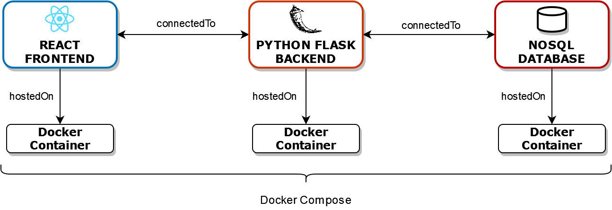

# Explainable Predictions on Tabular Data
A fullstack application for deep learning on tabular data with modern explainable AI methods.
In other words: Making predictions on spreadsheets with AI and explaining them.

Currently, there is no functionality implemented.

## Architecture

Short overview of the planned technology stack.

